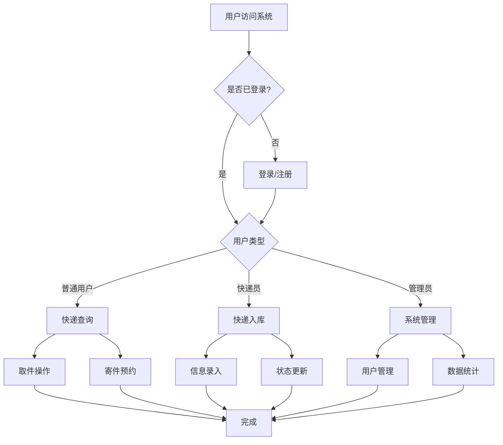
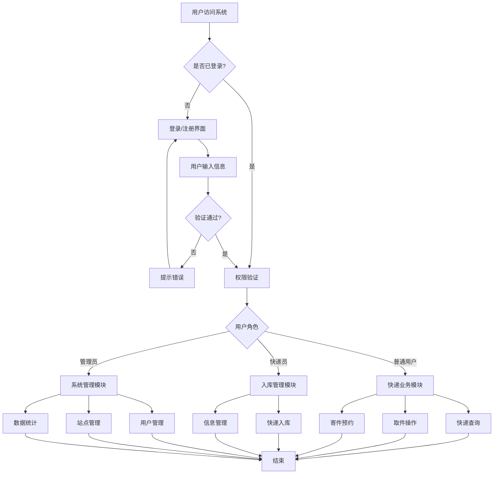
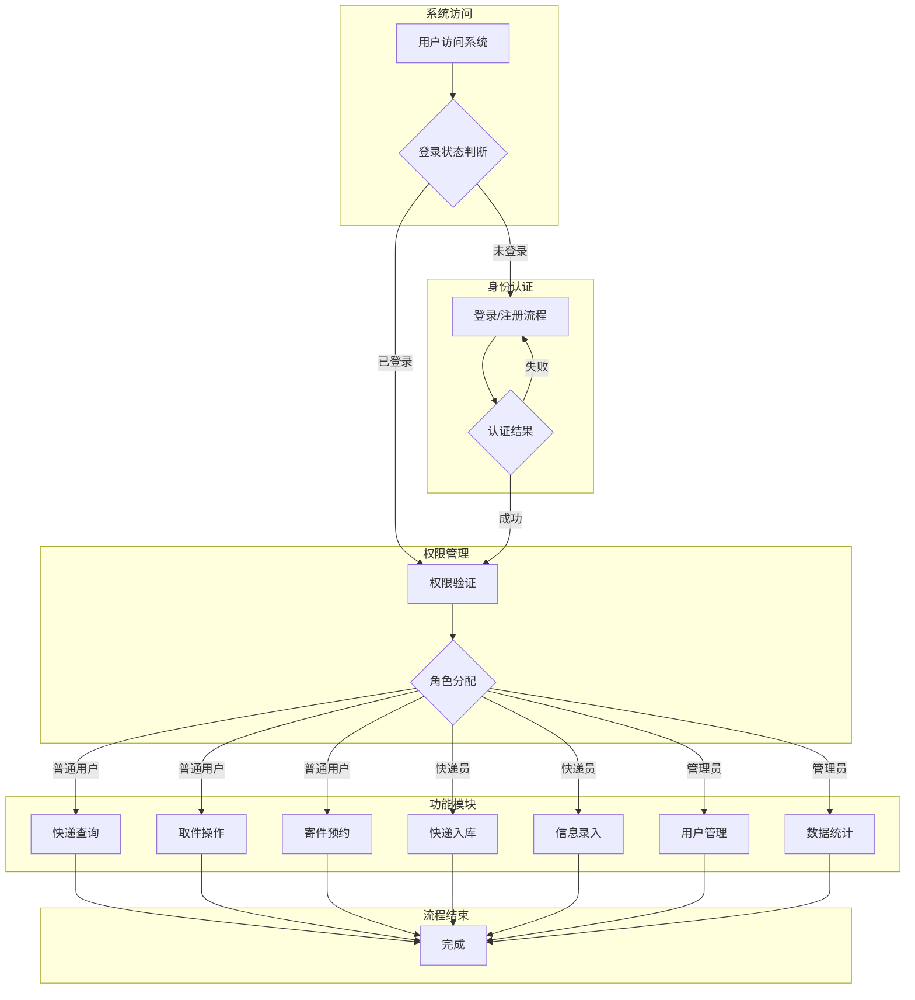

# 系统功能流程设计图（修正版）

## 一、简洁版（适合开题报告）

## 二、详细版

## 三、学术报告版

# 流程图说明

## 修正内容
1. **添加登录判断**：在用户访问系统后首先判断是否已登录
2. **完善认证流程**：登录失败时提供错误提示并返回登录界面
3. **优化权限管理**：登录成功后进行权限验证和角色分配
4. **保持简洁结构**：适合开题报告的学术格式要求

## 流程说明（适合开题报告文字描述）

1. **用户访问与登录判断**
   - 用户访问系统后，首先判断是否已登录
   - 未登录用户进入登录/注册流程，登录失败时返回登录界面
   - 已登录用户直接进入权限验证环节

2. **权限验证与角色分配**
   - 系统根据用户身份进行权限验证
   - 根据不同用户角色（普通用户、快递员、管理员）分配相应功能

3. **功能模块使用**
   - 普通用户：快递查询、取件操作、寄件预约
   - 快递员：快递入库、信息录入
   - 管理员：用户管理、数据统计

4. **流程结束**
   - 所有功能操作完成后，流程结束

此流程图符合学术报告的规范要求，清晰展示了系统的完整功能流程！