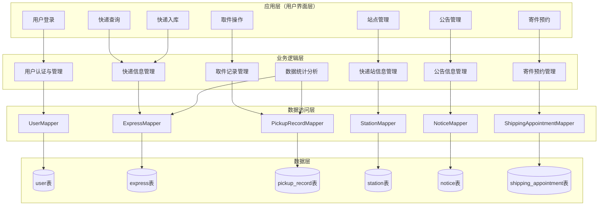
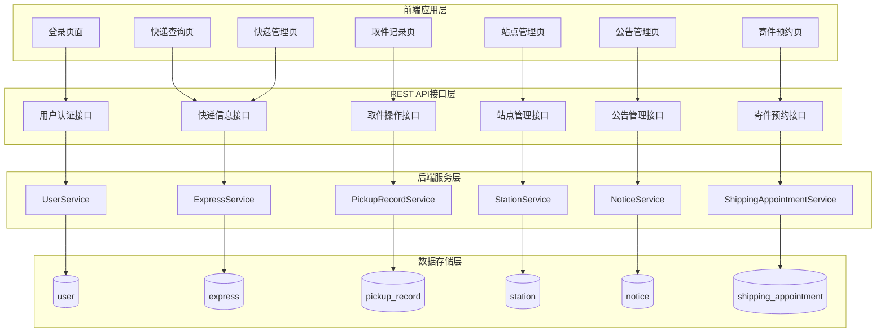
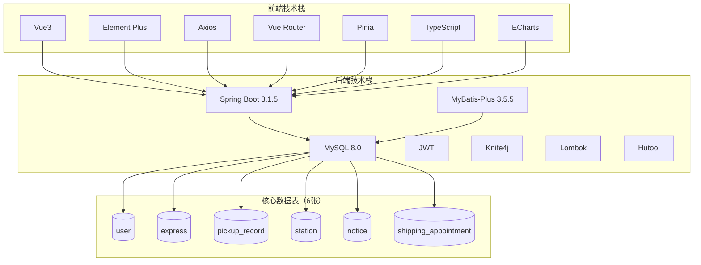

# 校园快递管理系统 - 修正版架构图（6张表）

## 矩形分层架构图（Mermaid代码）

## 核心功能架构图（Mermaid代码）

## 技术栈架构图（Mermaid代码）

# 修正说明

## 修正内容

1. **数据表数量修正** ✅
   - 原：7张表（包含不存在的"系统配置表"）
   - 现：6张表（全部实际存在）
   - 实际存在的表：
     - user表
     - express表  
     - pickup_record表
     - station表
     - notice表
     - shipping_appointment表

2. **Mapper层修正** ✅
   - 移除了不存在的"通用Mapper"
   - 统一使用实际的Mapper名称
   - 数据统计分析直接关联到ExpressMapper和PickupRecordMapper

3. **连接关系修正** ✅
   - 确保所有连接关系准确
   - 数据统计分析直接关联到快递和取件记录模块

## 实际数据表验证

根据项目实体类文件，实际存在的6个实体类：
- User.java → user表
- Express.java → express表
- PickupRecord.java → pickup_record表
- Station.java → station表
- Notice.java → notice表
- ShippingAppointment.java → shipping_appointment表

所有修正后的架构图均基于实际项目代码生成，确保数据准确！